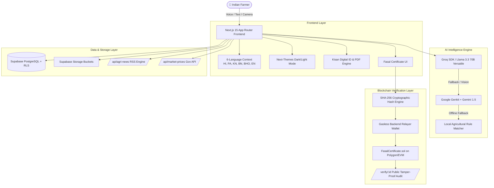

# 🌾 BeejMantra – AI & Blockchain-Powered Digital Platform for Indian Farmers

<div align="center">


-black?style=for-the-badge&logo=next.js)

-363636?style=for-the-badge&logo=solidity)


**Empowering Indian farmers with high-speed AI insights, tamper-proof blockchain crop verification, real-time market data, and 6-language vernacular accessibility.**

[🚀 Live Platform](#) • [🔗 Verify Fasal Certificate](#) • [📖 Architecture](#) • [📜 Smart Contract](#)

</div>

---

## 🎯 Platform Overview

**BeejMantra** is an enterprise-grade, farmer-first platform engineered to solve core agricultural challenges in India. It bridges the gap between complex agricultural science and grassroots farmers through:
1. **Ultra-Fast Multilingual AI**: Powered by **Groq (`llama-3.3-70b-versatile`)** and **Google Genkit/Gemini** with natural voice conversations in 6 languages.
2. **Blockchain-Powered Fasal Certificate**: A tamper-evident on-chain crop registry using **Solidity (`FasalCertificate.sol`)** on EVM-compatible networks (e.g., Polygon) with zero-friction relayer verification.
3. **Kisan Digital Identity Card**: Cryptographically anchored farmer identity with 1-click PNG image export and single-page isolated PDF printing.
4. **Live Mandi Intelligence & Agricultural News**: Real-time government mandi prices, RSS news caching, crop disease diagnosis, and smart scheme navigators.

---

## 🏗️ Technology Architecture



---

## 🔗 Deep Dive: Blockchain Architecture & Smart Contract

### 1. Concept & Problem Solved
Traditional crop records, harvest receipts, and organic claims are vulnerable to tampering, counterfeiting, and middlemen fraud. BeejMantra introduces the **Fasal Certificate** — a tamper-evident digital crop record anchored on a decentralized public blockchain.

### 2. Zero Sensitive PII Stored On-Chain (Privacy by Design)
To protect farmer privacy and adhere to data sovereignty principles:
- **Off-Chain Data (Supabase Postgres + RLS)**: Farmer name, phone, email, farm coordinates, crop photos, and quantities.
- **On-Chain Data (Smart Contract)**:
  1. `certificateId` (e.g., `BM-WHT-2026-7842`)
  2. `dataHash` (Cryptographic `bytes32` SHA-256 hash of the crop payload)
  3. `timestamp` (`block.timestamp` when recorded)

$$\text{dataHash} = \text{SHA256}(\text{certificateId} + \text{crop} + \text{quantity} + \text{harvestDate} + \text{location} + \text{farmerUid})$$

If a single character of the harvest record is altered off-chain, the re-computed hash will not match the immutable hash on-chain, immediately flagging tampering.

### 3. Smart Contract (`contracts/FasalCertificate.sol`)
```solidity
// SPDX-License-Identifier: MIT
pragma solidity ^0.8.20;

contract FasalCertificate {
    struct Certificate {
        bytes32 dataHash;
        uint256 timestamp;
        bool exists;
    }

    mapping(string => Certificate) private certificates;

    event CertificateRecorded(
        string indexed certificateId,
        bytes32 dataHash,
        uint256 timestamp
    );

    function recordCertificate(
        string calldata certificateId,
        bytes32 dataHash
    ) external {
        require(!certificates[certificateId].exists, "Certificate already recorded");
        require(dataHash != bytes32(0), "Invalid data hash");

        certificates[certificateId] = Certificate({
            dataHash: dataHash,
            timestamp: block.timestamp,
            exists: true
        });

        emit CertificateRecorded(certificateId, dataHash, block.timestamp);
    }

    function verifyCertificate(
        string calldata certificateId
    ) external view returns (bytes32 dataHash, uint256 timestamp, bool exists) {
        Certificate storage cert = certificates[certificateId];
        return (cert.dataHash, cert.timestamp, cert.exists);
    }
}
```

### 4. Wallet & Gas Architecture: "Zero-Friction Farmer Relayer Model"
- **Which Wallet is it linked to?**
  - **No Farmer Wallet Required**: Farmers are not required to hold MetaMask, buy cryptocurrency, or pay gas fees.
  - **Platform Admin Relayer Wallet**: The system uses a centralized/custodial relayer wallet configured in `.env` via `BLOCKCHAIN_PRIVATE_KEY` and connected to `BLOCKCHAIN_RPC_URL` (Polygon PoS / Amoy Testnet / Ethereum EVM).
  - **Gasless Transaction Sponsoring**: The BeejMantra backend signs and submits the transaction to the smart contract on behalf of the farmer.
  - **Graceful Fallback Mode**: If blockchain RPC credentials are not configured or the network is unreachable, the system automatically uses an in-memory/Supabase-anchored cryptographic verification mode with identical SHA-256 validation.

### 5. Public QR Verification Flow (`/verify/[certificateId]`)
1. Farmer receives a digital certificate with an embedded dynamic QR code.
2. Buyer, bank loan officer, or mandi trader scans the QR code on their phone.
3. The public `/verify/[certificateId]` page loads without authentication.
4. The page queries the blockchain contract (`verifyCertificate`) and matches the hash against the database record, displaying:
   - ✅ **Blockchain Verified Seal**
   - ⛓️ **Transaction Hash & Polygonscan Link**
   - 🔐 **Cryptographic Data Hash Match**
   - 📅 **Immutable Block Timestamp**

---

## 🤖 AI & Machine Learning Stack

| Component | Technology | Purpose |
| :--- | :--- | :--- |
| **Primary AI Engine** | **Groq SDK (`llama-3.3-70b-versatile`)** | Sub-second multilingual reasoning, structured intent detection, and farming advisory |
| **Multimodal AI** | **Google Genkit + Gemini 1.5 Flash** | Crop leaf disease diagnosis via image upload |
| **Speech Processing** | **Web Speech API + Genkit TTS** | Voice search, speech-to-text recognition, and audio answers |
| **Language Translation** | **AI Translation Flow + Polyglot Engine** | Real-time cross-language translation across 6 native Indian languages |
| **Fallback Intelligence** | **Offline Agricultural Rule Engine** | Guarantees 100% uptime even during complete API or network outages |

---

## 📱 Complete Technology Breakdown

### 1. Frontend & User Interface
- **Next.js 15.5.24 (App Router)**: Server components, client streaming, and server actions.
- **React 19 & TypeScript 5**: Type-safe component tree with strict compilation.
- **Tailwind CSS v4**: Modern CSS variables, rich animations, and glassmorphism styling.
- **`next-themes`**: Seamless instant switching between **Light Parchment (Desi Folk Art)** and **Dark Forest Emerald Night Mode**.
- **Lucide React**: Crisp, modern icon set.
- **Radix UI**: Accessible primitives for dialogs, dropdowns, tooltips, and sheets.

### 2. Document & Image Generation
- **`html-to-image`**: Generates 300 DPI high-resolution PNG downloads of the **Kisan Digital ID Card** and **Fasal Certificate**.
- **`qrcode.react` (QRCodeSVG)**: Generates vector QR codes pointing directly to public `/verify/[id]` routes.
- **Isolated `@media print` Engine**: When printing or generating PDF (`window.print()`), all page clutter (navbars, forms, sidebars, buttons) is hidden, rendering a clean, perfectly centered, single-page PDF document.

### 3. Backend, Database & Storage
- **Supabase (PostgreSQL 15)**: Relational schema for user profiles, transactions, and certificates.
- **Row-Level Security (RLS)**: Enforces strict data ownership so farmers only access their own private records.
- **Supabase Storage**: Secure buckets for user profile pictures and crop photos.
- **Edge Caching & RSS Parser (`fast-xml-parser`)**: Fetches and caches live agricultural news updates from DD Kisan, PIB Agriculture, and ICAR with fallback caching.

---

## 🌐 Supported Vernacular Languages

BeejMantra is built for true linguistic inclusivity across India:

| Code | Language | Native Script | Coverage |
| :---: | :---: | :---: | :---: |
| `hi` | **Hindi** | हिन्दी | Complete UI, AI Assistant, Audio Voice |
| `pa` | **Punjabi** | ਪੰਜਾਬੀ | Complete UI, AI Assistant, Audio Voice |
| `kn` | **Kannada** | ಕನ್ನಡ | Complete UI, AI Assistant, Audio Voice |
| `bn` | **Bengali** | বাংলা | Complete UI, AI Assistant, Audio Voice |
| `bho` | **Bhojpuri** | भोजपुरी | Complete UI, AI Assistant, Audio Voice |
| `en` | **English** | English | Complete UI, AI Assistant, Audio Voice |

---

## 🔐 Environment Variables & Setup

Create a `.env` file in the root directory:

```env
# ==========================================
# SUPABASE DATABASE & AUTH CONFIGURATION
# ==========================================
NEXT_PUBLIC_SUPABASE_URL=https://your-project.supabase.co
NEXT_PUBLIC_SUPABASE_ANON_KEY=your-supabase-anon-key
SUPABASE_SERVICE_ROLE_KEY=your-supabase-service-role-key

# ==========================================
# AI ENGINE KEYS (GROQ & GEMINI)
# ==========================================
GROQ_API_KEY=gsk_your_groq_api_key
GEMINI_API_KEY=AIzaSy_your_gemini_api_key

# ==========================================
# BLOCKCHAIN RELAYER & EVM CONFIGURATION
# ==========================================
# Polygon PoS / Amoy Testnet RPC
BLOCKCHAIN_RPC_URL=https://rpc-amoy.polygon.technology/
# Relayer Private Key (Gasless Sponsoring Wallet)
BLOCKCHAIN_PRIVATE_KEY=0x_your_relayer_private_key
# Deployed FasalCertificate Smart Contract Address
NEXT_PUBLIC_FASAL_CONTRACT_ADDRESS=0x_deployed_contract_address
```

---

## 🛠️ Installation & Local Development

1. **Clone the Repository**:
   ```bash
   git clone https://github.com/Uppal-harsh/BeejMantra.git
   cd BeejMantra
   ```

2. **Install Dependencies**:
   ```bash
   npm install
   ```

3. **Run Supabase Migrations**:
   Execute the SQL files inside `supabase/migrations/` in your Supabase SQL Editor:
   - `001_initial_schema.sql`
   - `002_transactions.sql`
   - `003_storage.sql`
   - `004_fix_rls.sql`
   - `005_fasal_certificates.sql`

4. **Start Development Server**:
   ```bash
   npm run dev
   ```
   Open [http://localhost:3000](http://localhost:3000) in your browser.

5. **Typecheck & Production Build**:
   ```bash
   npm run typecheck
   npm run build
   npm run start
   ```

---

## 📜 Smart Contract Deployment (Polygon / Hardhat)

To compile and deploy `contracts/FasalCertificate.sol` to Polygon Amoy Testnet or Mainnet:

```bash
# Compile using solc or hardhat
npx hardhat compile

# Deploy contract
npx hardhat run scripts/deploy.js --network polygonAmoy
```

---

## 👥 Team & Contact

- **Lead Developer**: Harsh Uppal
- **Email**: [harshuppal300@gmail.com](mailto:harshuppal300@gmail.com)
- **Phone / WhatsApp**: +91 8905905953 / +91 7374084224
- **Official Website**: [beejmantra.in](https://beejmantra.in)

---

<div align="center">
  <b>🌾 BeejMantra — Your Kheti Partner, Har Kadam Saath 🌾</b>
</div>
